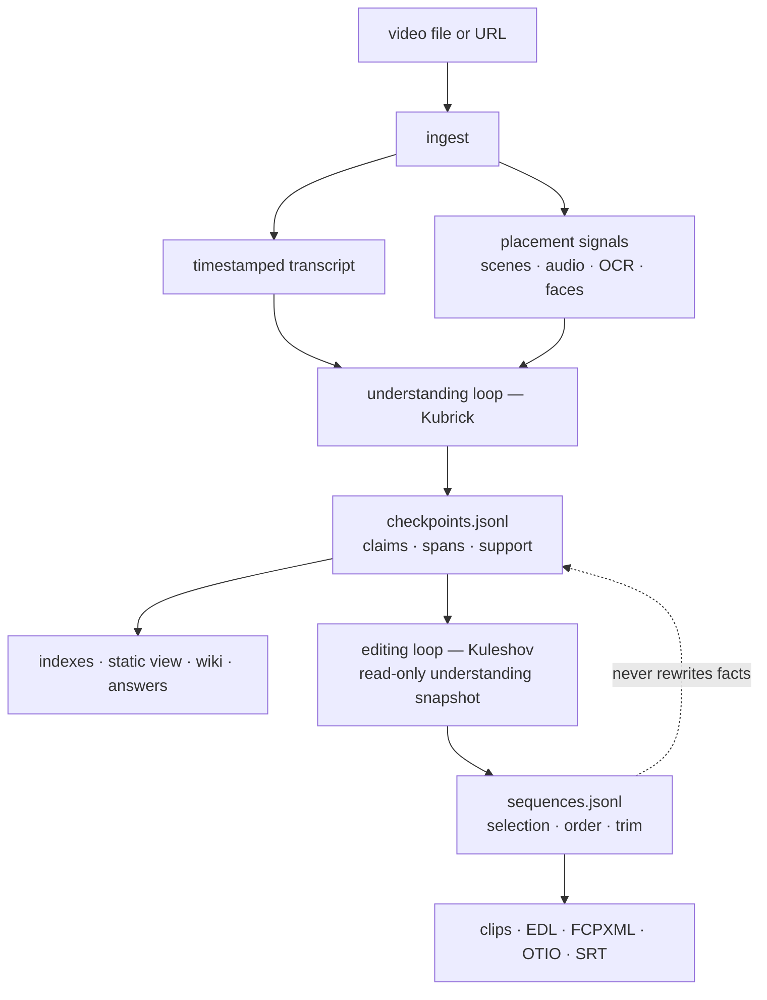

<div align="center">

<picture>
  <source media="(prefers-color-scheme: dark)" srcset="assets/brand/mark-dark.svg">
  
</picture>

# timecode:agent

**From long video to reusable, timestamped evidence.**

인간은 프레임이 아니라 사건을 기억한다.

[](.github/workflows/ci.yml)
[](LICENSE)
[](https://www.python.org/)
[](#requirements)

**English** · [한국어](README.ko.md)

</div>

TIMECODE-AGENT helps coding agents turn long video into a local, reusable
evidence ledger.

- **Transcript first.** Ingest produces a timestamped transcript (reusing the
  uploader's captions when they exist) plus deterministic placement signals —
  scenes, audio energy, OCR, faces — before any frame is sent to a model.
- **Lazy visual verification.** The coding agent inspects only the moments
  where a claim needs visual confirmation, and records what it verified as
  time-addressed checkpoints instead of a one-shot answer.
- **Evidence that persists.** Checkpoints, capture provenance, and edit
  decisions live in append-only ledgers; indexes, a static corpus browser,
  and wiki pages are rebuildable projections over them.
- **Grounded editorial handoff.** EDL, FCPXML, and OTIO exports are derived
  from recorded checkpoints or a pinned sequence — not from an unstored
  model reply; clip extraction and SRT rendering are supporting utilities
  that work on any span or the full transcript.

Typical uses: answering questions about long footage without re-watching it,
cutting highlights or shorts with receipts for every cut, and growing a
searchable corpus and wiki across many videos.

## Quickstart

```bash
git clone https://github.com/mupozg823/timecode-agent.git && cd timecode-agent
uv tool install --python 3.12 .

va ingest show.mp4 --model small --signals
va brief va-out/show
va capture va-out/show -t 1:23 -t 95
va status va-out/show
```

The first pass builds reusable local artifacts. Your coding agent reads those
artifacts, inspects decision-critical gaps, and records supported checkpoints
before any grounded edit is exported.


## Recently shipped

- **Legacy workspaces promote in place** — `va rebind` backfills pre-0.3.0
  workspaces into revision binding (dry-run by default) and refuses when the
  source is gone, so frozen corpora accept new evidence again.
- **Procedures compile into skill drafts** — recurring, visually grounded
  `task-*` steps become approval-pending skill drafts gated on tool-consensus
  intent coherence; `va skillgen --route` names what still blocks each
  candidate.
- **Beat-quantized rhythm editing** — `va beats` extracts a beat grid from a
  music track and `va beat-eval` gates sequence joins against it
  (p90 offset <= 40 ms), with a ledger-preserving snap proposal.
- **Story Map** — both ledgers projected onto one proportional timeline with
  grounding cross-highlight, a cut-provenance lane and speaker ribbons.
- **Persistent BM25 search index** — fingerprint-incremental FTS5 with hybrid
  Korean recall and RRF-routed ranking.
- **Experimental Windows support** — the workspace lock has an `msvcrt`
  fallback and CI runs a Windows smoke job; see
  [Requirements](#requirements).

All shipped to `main`. The current release is
[v0.4.0](https://github.com/mupozg823/timecode-agent/releases/tag/v0.4.0);
[v0.1.0](https://github.com/mupozg823/timecode-agent/releases/tag/v0.1.0) was
the first.

---

## Why it exists

A fixed-sampling workflow sends frames to a model before it knows which
moments matter. Short events can fall between samples, similar frames consume
the same budget repeatedly, and the next question often starts with no durable
state from the previous one.

TIMECODE-AGENT separates two concerns:

1. **Placement:** deterministic signals and bundled perception tools locate
   moments that may deserve attention.
2. **Selection:** the coding agent decides what a claim means, what evidence
   can support it, and whether more inspection is worth the cost.

The package stores those decisions as time-addressed artifacts instead of
leaving them in a one-shot model response.

| | Fixed-sampling baseline | TIMECODE-AGENT |
|---|---|---|
| First pass | frames first | **transcript and deterministic signals first** |
| Visual inspection | fixed interval or every detected change | **frames selected when a claim or request needs visual confirmation** |
| Durable result | summary or answer | **timestamped checkpoint and evidence artifacts** |
| Later question | sample or decode again | **search stored artifacts before targeted re-inspection** |
| Editorial delivery | flat cut list or none | **evidence-gated EDL / FCPXML / OTIO handoff** |

This table describes an architectural contrast, not a performance claim.
The included public benchmark is a regression gate; it does not establish
answer superiority, optimal frame selection, or human editing preference.

## How it works



Ingest reuses transcripts the uploader already made: a manual caption track
wins, then the uploader's original-language automatic track (`*-orig` is
requested first); a different-language track is only a last-resort fallback,
and caption requests are currently limited to `ko`/`en`. Only when no usable
caption track exists does whisper transcribe the audio — `--force-whisper`
opts back into transcription when word-level timing matters.

The signal layer proposes *where* evidence may be useful; it does not establish
semantic truth. The coding agent performs meaning-level selection and records
claims with resolvable time spans and evidence references.

Understanding and editing are separate write domains. Editing reads a pinned
understanding snapshot and records its own decisions. If a fact changes, the
checkpoint is corrected upstream and the affected edit is re-derived.

### The two loops: the Kubrick engine and the Kuleshov loop

The two procedures above carry director names in the Agent Skill, so a
request lands in the right loop with the right write permissions. The names
describe procedures, not installed modules.

| | **Kubrick** — the understanding engine | **Kuleshov loop** — the editing loop |
|---|---|---|
| Question | what is in this video, and how sure am I? | does this cut hold, and can it be defended? |
| Writes to | `checkpoints.jsonl` — the fact ledger | `sequences.jsonl` — the edit-decision ledger |
| Round trip | hypothesize from the transcript → pick verification points → capture → verify or correct → converge | draft cut alternatives → evaluate every cut boundary → re-snap → promote a terminal sequence |
| Never does | export a cut | rewrite a fact |

**Using Kubrick** — this is what the Agent Skill runs when you ask
"analyze this video"; every step also works by hand:

```bash
va ingest lecture.mp4 --signals   # transcript + placement signals
va brief va-out/lecture           # entry point: what is known so far
va filmstrip va-out/lecture --auto   # low-res overview of uncertain stretches
va capture va-out/lecture -t 95 --reason "speaker change"
# capture prints the evidence path — a nonempty --reason is slugged into it
va checkpoint add va-out/lecture --json-file - <<'JSON'
{"id":"cp-001","span":[83,125],"status":"verified",
 "hypothesis":"Q&A opens; a second speaker joins",
 "confidence":0.9,
 "visual_evidence":["frames/t000095000-speaker-change.jpg"]}
JSON
va status va-out/lecture          # coverage and readiness (advisory)
```

The loop converges when decision-critical claims have current support and
another observation is unlikely to change the answer — not when a fixed
frame budget is spent.

**Using the Kuleshov loop** — what runs when you ask for a defensible cut;
the [Cut workflow](#named-workflows) is its everyday entry:

```bash
va highlights va-out/lecture --json          # placement candidates
va sequence add va-out/lecture --json-file - <<'JSON'
{"id":"seq-001","intent":"lecture highlight",
 "cuts":[{"span":[83.0,125.0],"order":1,"role":"hook",
          "checkpoint_ids":["cp-001"]}],
 "status":"assembled"}
JSON
va boundary-eval va-out/lecture --sequence seq-001   # score cut edges and joins
# inspect and re-snap, then promote the same id to boundary_verified —
# exporting an "assembled" sequence would leave the receipt's
# checkpoint-revision map empty
va sequence add va-out/lecture --json-file - <<'JSON'
{"id":"seq-001","intent":"lecture highlight",
 "cuts":[{"span":[83.0,125.0],"order":1,"role":"hook",
          "checkpoint_ids":["cp-001"]}],
 "status":"boundary_verified"}
JSON
va clip va-out/lecture --start 83 --end 125 --accurate
va export va-out/lecture --format otio --sequence seq-001 -o cut.otio --receipt
```

The boundary between the loops is one-directional: the Kuleshov loop reads
the fact ledger and never writes it. A cut that rests on a wrong fact is not
patched in the sequence — the checkpoint is corrected in Kubrick and the
edit is re-derived.

<details>
<summary><b>Current scope</b></summary>

- The Python package performs media operations, deterministic signals, and
  persistence; the coding-agent harness supplies semantic judgment.
- Understanding and edit decisions use separate physical ledgers in one
  runtime.
- This release does not ship a separate `editcode-agent`, caller-specific
  write capabilities, or a typed evidence-request hand-back protocol.
- Wiki `tca:notes` and the workspace scene-log narrative remain preserved
  authored blocks rather than ledger-replayed state.

</details>

### Grounded editorial handoff

After an agent has checked the example span and the captured frame supports
its reading, record that support before exporting:

```bash
va checkpoint add va-out/show --json-file - <<'JSON'
{"id":"cp-001","span":[83,125],"status":"verified","hypothesis":"Verified answer segment","confidence":0.9,"visual_evidence":["frames/t000095000.jpg"]}
JSON
va export va-out/show --format edl --ids cp-001 -o cut.edl
grep -q '^001 ' cut.edl
```

The values are illustrative; use the span and evidence established for your
own video. The final command fails this example check if the EDL contains no
edit event. For revision-pinned, machine-gated multi-cut delivery, record a
terminal sequence and export it with `--sequence`.

## What it looks like

`va view` writes a self-contained static corpus browser and per-video
players — single HTML files, no server and no frontend framework. The pages
follow the OS color scheme; dark mode is shown here.


*Live tour: filter the library, explore the relation graph, then click a
scene record — the player jumps to that timestamp.*

| Corpus library — search, type, status, scene counts | Relation graph — videos ↔ people and entities |
|---|---|
|  |  |

| Workspace player — scene records beside the video | Timeline strip and verified scene cards |
|---|---|
|  |  |

The demo GIF and screenshots show a demo corpus built by running the tool on
the Blender Foundation open movies *Sintel*, *Elephants Dream*, *Big Buck
Bunny*, *Tears of Steel*, and *Charge*
(CC-BY, © Blender Foundation — [blender.org](https://www.blender.org/about/projects/)) —
including the same freely fetchable fixtures the
[reproducible benchmark](#reproducible-benchmark) uses.

## What persists

Each workspace keeps a manifest, transcript, append-only checkpoint events,
capture provenance, corrections, and optional edit decisions. Indexes, HTML
views, wiki pages, and NLE files are rebuildable projections.

```text
va-out/
├── INDEX.md
├── view.html
├── show/
│   ├── manifest.json
│   ├── transcript.json
│   ├── checkpoints.jsonl
│   ├── image-provenance.jsonl
│   ├── corrections.jsonl
│   ├── sequences.jsonl
│   ├── .workspace.lock
│   ├── .checkpoint.lock
│   ├── .image-provenance.lock
│   ├── .sequences.lock
│   ├── frames/
│   └── wiki/
└── another-video/
```

Ingest publishes source, transcript, and timing revision IDs in the manifest.
New checkpoints, image-provenance events, sequences, and NLE receipts carry
that binding. `va ingest` will not overwrite a published workspace or a
manifest-less directory that already contains durable evidence; use `va brief`
to resume, or a fresh `-o` path for a new source or transcript generation. If
the first ingest fails before revision publication, the manifest remains
`building` and the same source plus `-o` path can be retried safely.
Seconds remain the CLI display/input surface, while new ledger records also
store a half-open stream PTS/time-base span. Before a revision-bound NLE
handoff, the complete decoded video timeline must prove one uniform rational
cadence, including every frame duration and the final boundary;
`avg_frame_rate == r_frame_rate` is only a hint. VFR, unknown, or irregular
timing stays blocked until decoded-frame snapping/export is available.
Pre-revision workspaces remain readable, but are read-only for new checkpoints,
image provenance, and sequences; create a fresh ingest workspace before adding
evidence. A new draft created directly through the current Python API binds its
source, transcript, and timing on the first evidence write.

`va search "<terms>"` queries a persistent FTS5 index (word and trigram
retrievers fused per source family) across workspace transcripts,
checkpoints, and OCR, synced incrementally per workspace fingerprint.
`va view` writes a self-contained static corpus browser. `va wiki` projects entities, relations, quotes, and scene
notes into Markdown. No vector database is the source of truth.

`va index`, `va view`, and `va wiki` accept one corpus root, or workspace
paths that share one explicitly supplied common root. Independent roots are
rejected before any projection is written so links cannot silently collide.
Commands hold a shared workspace operation lease while reading or writing;
ingest and whole-workspace garbage collection take the exclusive side of that
lease, so an active capture, transcription, signal pass, or projection cannot
be removed underneath the command.
Corpus commands operate on the exact workspace snapshot they leased rather
than rediscovering mid-run, and ingest keeps its exclusive lease through final
manifest or signal-summary output.
Published legacy workspaces without `.workspace.lock` serialize each command
through an exclusive lease on the existing workspace-directory inode.

## Command surface

| Family | Commands |
|---|---|
| Ingest and corpus | `ingest` `glossary` `audit` `rebind` `search` `index` `view` `wiki` `skillgen` `bridge` `gc` |
| Placement and inspection | `brief` `capture` `keyframes` `audioevents` `diarize` `faces` `ocr` `filmstrip` `highlights` `scenes` |
| Understanding state | `checkpoint add/list/observe` `ask` `status` |
| Editing and delivery | `sequence add/list` `boundary-eval` `beats` `beat-eval` `clip` `export` `reframe` |
| Runtime and configuration | `runtime` |

The same CLI is available as `va` and `tca`.

A few commands are worth a direct mention beyond the table above:

- `filmstrip` tiles a time window into a contact-sheet grid for fast visual
  scanning; `--auto` splits a long span into density-ruled windows instead of
  one oversized image. Run it locally against your own footage; this
  repository does not ship any third-party contact-sheet images.
- `diarize` adds who-spoke-when speaker turns; `--backend auto` prefers the
  gated `pyannote` model when a Hugging Face token is present (environment
  variable or `hf auth login` cache) and otherwise uses the ungated `sherpa`
  backend. Run it before recording checkpoints or other transcript-dependent
  evidence: it advances the transcript revision, and is refused once such
  evidence exists.
- `va checkpoint observe <workspace> --id <id> --frame <frames/...jpg>
  --subject "seated man" --state present|absent|uncertain --hypothesis "..."`
  records one query-selected, provenance-tracked, uncropped frame as a typed
  `person_presence` checkpoint. The command derives the observation timestamp
  and matching `visual_evidence` path from that frame. Use `uncertain` whenever
  the frame does not resolve presence; it remains a hypothesized observation.
- `va ask <workspace> "how many times did the seated man leave the screen?"`
  accepts narrow English and natural Korean variants of that one event-count
  intent. Its deterministic reader consumes typed `person_presence`
  observations and current, provenance-tracked full-resolution frames. It
  reports verified departures separately from uncertain intervals; ambiguous
  subjects, actions, or count requests fail with a specific diagnostic.
  Default `--format human --lang auto` renders Korean questions in Korean and
  English questions in English; `--lang ko|en` overrides detection.
  `--format agent-json` projects the same once-calculated envelope as compact
  JSON with English identifiers and reason codes. It preserves a normalized
  `reply_locale` (for example, `ja-JP` becomes `ja`) so a host LLM can localize
  without parsing human prose. The CLI itself neither invokes an LLM nor
  translates. `va ask` is read-only and never appends or rewrites checkpoint
  or image provenance. Missing evidence is not a zero count or proof.

```bash
va ask va-out/clip "앉아 있던 남자가 화면 밖으로 몇 번 나갔나요?"
va ask va-out/clip "how many times did the seated man leave the screen?" --lang en
va ask va-out/clip "how many times did the seated man leave the screen?" \
  --format agent-json --lang ja-JP
```

```json
{"v":1,"intent":"person_exit_count","subject":"seated_man","reply_locale":"ja","status":"partial","count":1,"verified":[{"from_ms":12000,"to_ms":18000,"evidence":["frames/frame-000012.000.jpg","frames/frame-000018.000.jpg"]}],"uncertain":[{"from_ms":0,"to_ms":12000,"code":"UNOBSERVED_PREFIX"},{"from_ms":18000,"to_ms":30000,"code":"UNOBSERVED_SUFFIX"}],"next_ms":[6000,24000]}
```
- `boundary-eval` scores a recorded sequence's cut points and joins
  (speech-cut, breath, loudness step) so an edit can be re-snapped before
  export instead of after review.
- `beats` extracts a fixed-tempo beat grid (beats.json) from a music track;
  `beat-eval` gates a sequence's output-timeline joins against it
  (p90 offset <= 40ms), and `--snap` prints a span proposal that lands
  every join on a beat.

### Options reference

Every flag below is taken from each command's `--help`; defaults shown are
the argparse or effective runtime defaults, not documentation guesses.

<details>
<summary><b>Ingest and corpus</b></summary>

| Command | Flag | Default | Meaning |
|---|---|---|---|
| `ingest` | `--max-height` | `1080` | URL download resolution cap |
| `ingest` | `--cookies-from-browser` | none | `chrome`\|`safari`\|`firefox` — pass browser cookies to `yt-dlp` for a login-walled source; only needed when the source requires your own session |
| `ingest` | `-o`, `--out` | `./va-out/<stem>` (local file) or `./va-out/url-<md5-prefix>` (URL) | fresh workspace directory — existing manifests or orphaned durable evidence fail closed; always pass it for URLs so the resume path is known in advance |
| `ingest` | `--model` | `small` | whisper size (`tiny`\|`base`\|`small`\|`medium`\|`large-v3`), or any CTranslate2 model — local path or HF repo id |
| `ingest` | `--asr-backend` | `auto` | ASR execution path (`auto`\|`faster-whisper`\|`mlx`) — `auto` follows the runtime profile: `balanced`/`quality` = faster-whisper, Apple Silicon `low-power` = MLX with VAD and a quality fallback |
| `ingest` | `--lang` | auto-detect | e.g. `ko`, `en` |
| `ingest` | `--hotwords` | auto-loaded from the `va glossary` cache | domain terms fed to whisper |
| `ingest` | `--force-whisper` | off | transcribe even when the video ships captions |
| `ingest` | `--signals` | off | also compute highlights + scenes and print the brief (one-call session start) |
| `glossary` | `workspaces` (positional) | prints current status | workspaces to update; omit to just view |
| `glossary` | `--all` | off | collect corrections from every workspace under `./va-out` |
| `audit`, `search`, `index`, `view`, `wiki`, `skillgen` | `roots` (positional) | `./va-out` | one corpus root, or workspaces sharing one explicit common root |
| `search` | `query` (positional) | required | space-separated terms, prefix-matched |
| `search` | `--top` | `10` | max results |
| `index` | `--graph-reset` | off (created only if absent) | overwrite Obsidian's `.obsidian/graph.json` display preset with the shipped defaults |
| `wiki` | `--include-hypotheses` | off | compatibility projection that also includes hypothesized (unverified) labels |
| `bridge` | `vault` (positional) | required | existing brain-vault directory to attach |
| `bridge` | `--corpus` | `./va-out` | stub-source corpus root |
| `gc` | `paths` (positional) | `./va-out` | workspace or root paths |
| `gc` | `--purge` | — | `captures`\|`media`\|`clips`\|`workspace`, repeatable or comma-separated; `media` warns "no re-capture" and never touches transcript/checkpoint text |
| `gc` | `--keep-days` | — | with `--purge workspace`: drop workspaces whose newest file is older than N days (required for that mode) |
| `gc` | `--yes` | off | actually delete; otherwise a dry-run listing only |

</details>

<details>
<summary><b>Placement and inspection</b></summary>

| Command | Flag | Default | Meaning |
|---|---|---|---|
| `brief` | `--why` | — | analysis intent/question — surfaces the relevant transcript spans and checkpoints in the briefing |
| `capture` | `-t` (repeatable) | required | timestamp (`12.5`\|`1:23.5`\|`01:02:03`) |
| `capture` | `--crop` | full frame | ffmpeg crop expression `w:h:x:y` (`iw`/`ih` allowed) — capture just a UI region |
| `capture` | `--reason` (repeatable) | none | triggering signal, recorded as a causal edge in `image-provenance.jsonl` for session-crossing auditability |
| `capture` | `--sharp` | off | sharpness gate — picks the crispest of `t±window` via Sobel edge energy across 3 candidates |
| `capture` | `--window` | `0.3` | sharp-gate candidate offset, seconds |
| `keyframes` | `--budget` | `12` | max frames to select |
| `keyframes` | `--start`, `--end` | full video | selection window |
| `keyframes` | `--min-gap` | `1.0` | minimum seconds between picks |
| `keyframes` | `--explain` | off | show displaced candidates and why (`min_gap_displaced`/`budget_exhausted`) |
| `keyframes` | `--legible-endcard` | off | pick the most static tail candidate instead of a fixed `duration-1` endcard |
| `filmstrip` | `--start`, `--end` | `0` / video duration | contact-sheet window |
| `filmstrip` | `-n` / `--cols` | `9` / `3` | tile count, grid columns |
| `filmstrip` | `--auto` | off | density-rule tiling: split the span into bounded windows with bounded cell gaps |
| `highlights` | `--top` | `5` | number of peaks to return |
| `highlights` | `--window` | `0.5` | RMS window, seconds |
| `scenes` | `--threshold` | `0.3` | cut-detection sensitivity |
| `scenes` | `--adaptive` | off | also catch gradual changes vs. a rolling average |
| `scenes` | `--color-check` | off | cross-check detections with a brightness-free H-S histogram to flag lighting false positives |
| `audioevents` | `--min-conf` | `0.6` | confidence floor |
| `diarize` | `--num-speakers` | auto | expected speaker count |
| `diarize` | `--backend` | `auto` | `auto` prefers gated `pyannote` (HF token via env or `hf auth login`), falls back to ungated `sherpa` |
| `faces` | `-t` (required, repeatable) | — | timestamp(s) to detect faces on |
| `faces`, `ocr` | `--crop` | full frame | ffmpeg crop expression `w:h:x:y` |
| `ocr` | `-t` (repeatable) | — | single timestamps |
| `ocr` | `--every` | — | scan mode: OCR every N seconds, merge repeats into `ocr_transcript.json` |
| `ocr` | `--start`, `--end` | `0` / duration | scan span |
| `ocr` | `--lang` | `ko-KR,en-US` | comma-separated language list |

</details>

<details>
<summary><b>Understanding state</b></summary>

| Command | Flag | Default | Meaning |
|---|---|---|---|
| `checkpoint add` | `--json` / `--json-file` | — | checkpoint object as a JSON string / file path (`-` for stdin) |
| `checkpoint add` | `--id` / `--span` / `--status` / `--hypothesis` / `--confidence` / `--segments` / `--visual-evidence` / `--note` | — | build the checkpoint from flags instead of JSON; mixing the two input paths is rejected, including an explicitly empty value |
| `checkpoint observe` | `--id` / `--frame` / `--subject` / `--state` / `--hypothesis` | required | bind one tracked, uncropped point frame to a typed `person_presence` checkpoint; unresolved frames use `uncertain` and stay hypothesized |
| `ask` | `workspace`, `question` (positional) | required | narrow, read-only seated-person screen-departure count from structured checkpoint observations and tracked timestamped frames |
| `ask` | `--lang` | `auto` | infer `ko` from a Korean question and otherwise `en`, or normalize an explicit BCP-47 primary language tag; direct human rendering supports `ko` and `en` |
| `ask` | `--format` | `human` | localized human text, or compact `agent-json` with English identifiers and `reply_locale` for host-LLM localization |
| `checkpoint list`, `status` | `--json` | off | machine-readable output |

</details>

<details>
<summary><b>Editing and delivery</b></summary>

| Command | Flag | Default | Meaning |
|---|---|---|---|
| `sequence add` | `--json` / `--json-file` | — | sequence object as a JSON string / file path (`-` for stdin) |
| `sequence list` | `--json` | off | machine-readable output |
| `boundary-eval` | `-t` (repeatable) | — | ad-hoc cut points to score |
| `boundary-eval` | `--sequence` | — | score a recorded sequence's cuts and joins |
| `boundary-eval` | `--window` | `0.4` | audio window around each boundary, seconds |
| `beats` | `--seconds` | full length | analyze only the leading N seconds |
| `beats` | `--out` | `<media>.beats.json` | beat-grid artifact path |
| `beat-eval` | `--beats` | required | beats.json produced by `va beats` |
| `beat-eval` | `--sequence` | required | sequence id to gate |
| `beat-eval` | `--gate-ms` | `40` | p90 join-to-beat tolerance, ms |
| `beat-eval` | `--snap` | off | print a beat-snapped span proposal |
| `skillgen` | `--route` | off | per-task gate status without compiling |
| `clip` | `--start`, `--end` | required | clip boundaries |
| `clip` | `-o`, `--output` | — | filename inside `clips/` |
| `clip` | `--accurate` | off (stream copy) | re-encode for exact boundaries |
| `clip` | `--hw` | — | `h264`\|`hevc` VideoToolbox hardware encode (macOS previews; requires `--accurate`) |
| `export` | `--format` | required | `edl`\|`md`\|`xml`\|`otio`\|`fcpxml`\|`srt` |
| `export` | `--ids` | — | comma-separated checkpoint ids — the given order is the cut order |
| `export` | `--sequence` | — | sequence id — export the edit ledger's cuts (`edl`/`otio`/`fcpxml` only, mutually exclusive with `--ids`) |
| `export` | `-o`, `--output` | — | output path |
| `export` | `--receipt` | off | `<output>.receipt.json` sidecar — output sha256 plus the evidence checkpoints' revision/status (`edl`/`otio`/`fcpxml` only, requires `-o`) |
| `reframe` | `clip` (positional) | required | path or filename inside `clips/` |
| `reframe` | `--roi` | required | `x,y,w,h`, repeatable per person — face ROI in clip pixel coordinates |
| `reframe` | `--mode` | `pan` | `pan`\|`split` |
| `reframe` | `--min-dwell` | `1.0` | minimum seconds per pan segment; shorter blips merge into the previous speaker |
| `reframe` | `-o`, `--output` | — | filename inside `clips/` |

</details>

Commands that accept it also take `--json` for machine-readable output;
`capture`, `diarize`, and `filmstrip` do not.

## Measured numbers

Numbers below are from one machine and one input, stated so they are
reproducible rather than persuasive — they describe this repository's own
ingest path, not a comparison against another tool.

Device: Apple M4 Pro (8 performance + 4 efficiency cores), macOS. Input: a
43-minute (2,580 s) 1080p Korean YouTube vlog.

| Path | Wall time | Condition |
|---|---|---|
| `va ingest <url>` end-to-end via whisper (535 MB video download + transcribe) | ~9 min | `--force-whisper`, `small` model, beam size 5, word timestamps |
| `va ingest <url>` end-to-end, captions-first (default) | **24.5 s** | the video carries an original-language caption track |
| Caption track download alone | 2.7 s | same video, caption fetch only |
| `small`-model transcription alone, same audio | ~12 min | shown for comparison against the caption download above |

On one sampled phrase in this video the caption track was also the more
accurate source: the `small` model misheard "세계 정복" (world domination) as
"세계정보" (world information) while the uploader's caption carried the
correct text — a sample, not a generalization.

Caption-derived cues land on roughly 10-second boundaries after rolling
normalization (2,530 raw cues → 238 normalized cues covering 5.9–2,569.8 s in
this input); pass `--force-whisper` when a cut needs tighter word-level
timing than that grain.

This table describes one input on one machine and is not a benchmark; see
[Reproducible benchmark](#reproducible-benchmark) for the regression gate.

## Case study: a silent transcription stall

`va ingest` transcribes with faster-whisper 1.2.1. On the same 43-minute
Korean input above, its decode loop occasionally stopped emitting segments
past 1,092 seconds — no exception, no warning, exit code 0.

Isolating the boundary ruled out the obvious causes: ffmpeg's audio
extraction was a complete, correctly-durationed 2,580.1 s WAV, and Silero VAD
found 2,303.8 s of speech overall, including 1,274.6 s of it *after* the
1,092 s cutoff. The fault lived inside whisper's own decode loop, not the
input.

It was also nondeterministic on identical input: 1 of 3 back-to-back runs
collapsed to 92 segments, while the other 2 completed with 757 and 895
segments respectively. A downstream consumer felt this directly — `va brief`
on the collapsed transcript concluded the video was "19% speech, visual-led";
on a complete transcript, the same video is "95% speech, speech-led."

The fix does not try to make faster-whisper's decode loop deterministic.
Instead, `va ingest` compares transcribed duration against VAD-detected
speech duration and records the ratio as `transcript_coverage` in the
manifest. Below a 0.5 coverage threshold — and only for files with at least
60 s of detected speech, so short or near-silent clips aren't churned
needlessly — it re-transcribes once with `condition_on_previous_text=False`
and keeps whichever attempt covers more of the detected speech, stamping
`transcript_repair` when that happens. In the two runs above, the collapsed
transcript scored 0.211 coverage (0.289 below the 0.5 gate) and the healthy
one 0.809 (0.309 above it) — not a hair's-width threshold call on this input.
(Implementation: `_transcript_collapsed` in `src/video_agent/ingest.py`.)

The manifest also stamps `asr_backend` — which backend produced the adopted
transcript (faster-whisper, or an MLX fallback), suffixed `+<backend>(tail)`
when a tail retranscribe contributed part of it — so a quality comparison can
name its own source instead of guessing. It is `null` when no ASR ran at all,
which is exactly the uploader-caption path: read `transcript_source`
(`subtitles`) to identify that case.

## Requirements

- Python 3.12 on macOS or Linux ([`uv`](https://docs.astral.sh/uv/getting-started/installation/)
  provisions it: `uv tool install --python 3.12 .`)
- `ffmpeg` and `ffprobe` on `PATH`
- `yt-dlp` for URL ingest
- A coding-agent harness that can discover the included Agent Skill
- Interface language: mixed. Most `--help` text is English, while diagnostics,
  the `va brief`/`va status` summaries, and the `va view` UI are Korean; no
  global locale switch exists. The narrow `va ask` surface is the exception:
  deterministic human output supports Korean and English, while `agent-json`
  carries other reply locales to the host LLM. Ledgers and handoffs speak
  whatever language you write into them; see [Notes](#notes).
- Windows is experimental: the core CLI, ledgers, and workspace locking run
  (shared locks degrade to exclusive via `msvcrt`), a CI smoke job exercises
  install → import → lock round-trip → CLI startup, and the Apple-backed
  cues (OCR, faces, semantic audio events) are unavailable as on Linux

| Dependency | macOS | Linux |
|---|---|---|
| `ffmpeg` + `ffprobe` | `brew install ffmpeg` | `sudo apt install ffmpeg` (or your distro's package manager) |
| `yt-dlp` (URL ingest only) | `brew install yt-dlp` | `uv tool install yt-dlp` |

Verify both are reachable before the first ingest:

```bash
ffmpeg -version && ffprobe -version
yt-dlp --version
```

The first `va ingest` for a given `--model` size downloads that
faster-whisper model into the Hugging Face hub cache
(`HF_HOME`/`~/.cache/huggingface`) — `small` measured 484 MB on disk here;
check upstream before assuming a number on a metered connection, since
published weights can change.

Media ingest, signal extraction, and persistence run locally by default.
URL ingest uses the network. `scripts/install.sh` prepares the ungated default
model artifacts up front; a direct package install may download them on first
use. The coding-agent harness may use an external model service or incur its
own cost.

| Capability | macOS | Linux |
|---|---|---|
| Core CLI, ffmpeg signals, transcription, ledgers | supported | supported and exercised by the portable CI surface |
| ASR acceleration | faster-whisper in the measured `balanced` default; MLX + VAD + quality fallback in `low-power` on Apple Silicon | faster-whisper |
| URL ingest | `yt-dlp` required | `yt-dlp` required |
| OCR and face cues | Apple Vision backend installed by default | unavailable; workflow degrades to other evidence |
| Semantic audio events | Apple Sound Analysis backend installed by default | unavailable; energy highlights remain available |
| Diarization | ungated sherpa installed by default; gated pyannote via the `diarize` extra (the installer includes it) | same |
| OTIO editorial handoff | OpenTimelineIO installed by default | same |
| Hardware clip preview | VideoToolbox + AudioToolbox AAC in `low-power` or by explicit selection | software encoding |

Set `VIDEO_AGENT_CACHE_DIR` to choose the cache root for diarization model
assets and the glossary cache (whisper models live in the Hugging Face hub
cache above). On Linux,
`XDG_CACHE_HOME` is honored when the explicit override is absent.

### Installer

The portable installer checks dependencies, installs the standalone CLI with
Python 3.12 and every supported runtime backend, prepares faster-whisper, MLX
(Apple Silicon), and ungated sherpa model assets, and copies the Agent Skill so
it survives moving or deleting the checkout:

```bash
scripts/install.sh --dry-run
scripts/install.sh
```

The installer includes the `diarize` extra, so pyannote's Python runtime is
present after `scripts/install.sh`; its remote model stays account-gated by
Hugging Face, and without an accepted token the prepared ungated sherpa
backend handles diarization immediately. A bare
`uv tool install --python 3.12 .` skips pyannote's ~700 MB torch stack
entirely (sherpa still works); opt back in any time with
`uv tool install --python 3.12 '.[diarize]'`. `--skip-models` is the
explicit opt-out from initial model preparation.

Every feature starts enabled. Runtime policy can be inspected and changed
without reinstalling:

```bash
va runtime status
va runtime set profile low-power
va runtime set asr-backend mlx
va runtime set clip-encoder hevc-videotoolbox
va runtime set feature.ocr off
va runtime reset
```

`balanced` deliberately retains the measured stable paths: faster-whisper for
ASR and software encoding for accurate delivery clips. `low-power` selects MLX
and VideoToolbox only on Apple Silicon; MLX uses speech-only timestamps and
falls back to faster-whisper when its repetition/quality gate fails. Installing
all backends therefore adds download time and disk use, but does not force the
slower path or import every heavy model on ordinary commands.

Optional Obsidian and Media Extended setup is available through
`scripts/install.sh --all`. The default installer does not alter an Obsidian
vault. Contributors who intentionally want the CLI to follow a development
checkout can use:

```bash
uv tool install --python 3.12 --editable .
```

## Usage

```bash
# A YouTube / URL source — always pass -o so you know the resume path
va ingest "https://youtu.be/..." --signals -o va-out/my-video
va brief va-out/my-video

# A local file, Korean transcript, signals in one call
va ingest lecture.mp4 --model small --lang ko --signals

# Captions exist but a cut needs word-level timing — transcribe into a
# FRESH workspace (re-ingesting a populated one is refused before mutation)
va ingest "https://youtu.be/..." --force-whisper -o va-out/my-video-whisper

# Login-walled source (e.g. Instagram): add --cookies-from-browser chrome
# (or safari / firefox) — only pass this when you need your own session
va ingest "https://instagram.com/reel/..." --cookies-from-browser chrome -o va-out/reel
```

Ask questions through your coding agent (the Agent Skill below), then come
back to the same workspace later with `va search "<terms>"` and
`va brief <workspace>` — stored artifacts answer before any re-inspection.
Open the corpus browser any time with `va view` (writes `va-out/view.html`).

### Named workflows

The Agent Skill names the four everyday command chains so a request can be
routed without memorizing flag combinations. Import and Search feed the
[Kubrick engine](#the-two-loops-the-kubrick-engine-and-the-kuleshov-loop);
the Cut workflow is the everyday entry into the Kuleshov loop; the Archive
projects what both loops recorded:

| Workflow | What it does | Command chain |
|---|---|---|
| **Import** (가져오기) | first pass over new footage: transcript, signals, first brief | `va ingest --signals` → `va brief` |
| **Search** (검색) | recall over an existing corpus — no re-ingest | `va search` → `va brief <workspace>` |
| **Cut** (컷) | evidence-gated highlight / shorts assembly | `va highlights` → `va sequence add` → `va boundary-eval` → `va clip` / `va reframe` → `va export` |
| **Archive** (아카이브) | knowledge projection over the corpus | `va index` → `va wiki` → `va view` → `va bridge` |

Saying "import and analyze this file" or "cut workflow, 9:16" to a harness
with the skill installed resolves to these chains.

## Agent Skill

`skill/` is the canonical Agent Skill source. Install the whole directory
through your harness's documented skill mechanism. The installer copies it to
the supported Claude Code and Codex-compatible discovery locations; symlinks
are reserved for explicit development mode through `--link-skills`.

The default copy targets are
`$HOME/.claude/skills/timecode-agent` and
`$HOME/.agents/skills/timecode-agent`. Invoke it explicitly as
`/timecode-agent` in Claude Code or `$timecode-agent` in Codex; compatible
harnesses may also discover it from the task description.

The installed directory must be named `timecode-agent` so its basename matches
the Agent Skill frontmatter `name`. The repository keeps the canonical source
under `skill/`; `scripts/install.sh` applies the required installed name. Use
`timecode-agent` as the directory name for manual links or uploaded archives.

The skill defines the transcript-first inspection loop, evidence selection,
checkpoint updates, convergence checks, and editorial handoff. The package
does not embed an LLM.

## Reading the corpus

`va index` and `va wiki` emit plain Markdown, so the corpus does not require a
particular notes application. Open `va-out/INDEX.md` in any Markdown viewer,
or use `va view` for the generated static browser.

Obsidian is an optional reader for links, backlinks, properties, graphs, and
timestamp navigation:

- Open `va-out/` directly as a vault.
- Use Obsidian's bundled graph, properties, backlinks, search, and file
  explorer features.
- Optionally install
  [Media Extended](https://github.com/aidenlx/media-extended) for timestamped
  playback from note links.

See [Obsidian setup](docs/obsidian-setup.md) for the guarded installer path.

## Reproducible benchmark

The public regression gate uses declared CC-licensed Blender open-movie
fixtures that are fetched at run time:

```bash
uv run --python 3.12 --no-dev python benchmarks/run_bench.py --set public --fetch
```

<details>
<summary><b>What is measured — and what is not</b></summary>

The runner checks broad expected ranges for ingest and deterministic signal
artifacts, recommended content mode, readiness state, and a generous runtime
ceiling intended to catch regressions rather than rank hardware.

It does not measure answer correctness, aesthetic quality, human editing
preference, evidence-selection optimality, cross-video generalization, token
cost, or a compile-once break-even point.

This is a different measurement from the Measured numbers section above:
that section reports one machine's ingest wall-clock times on one real
video; this benchmark is a CI regression gate over synthetic public
fixtures, not a source of performance claims either.

</details>

## Notes

- Language is mixed, and handoffs inherit yours. Roughly two thirds of the
  `--help` strings are English, while diagnostics, the `va brief`/`va status`
  summaries, and the `va view` UI are Korean; no global locale switch is
  implemented. `va ask` alone has a narrow dual surface: direct human output
  follows Korean-versus-English question detection (or `--lang ko|en`), while
  compact `agent-json` preserves another requested reply locale for the host
  LLM. It does not perform translation itself.
  Timestamps and structural fields are language-neutral, but prose is not:
  `srt` carries transcript text, `md` renders checkpoint hypotheses, and
  `edl`/`xml`/`fcpxml`/`otio` embed the checkpoint `situation` or `hypothesis`
  in comments, markers, and metadata. Whatever language you write into the
  ledger is the language your NLE handoff speaks — the agent writes those
  fields in the language you asked in.
- Only ingest content you have the right to download and analyze. The
  `--cookies-from-browser` option exists for your own authorized sessions —
  never ship credentials in a repository.
- One workspace per source/transcript revision. Resume with
  `va brief <workspace>` — re-running `va ingest` into a ready or pre-revision
  workspace is rejected before manifest or transcript mutation. Only an
  explicitly incomplete `building` ingest can retry the same source and `-o`
  path; use a fresh `-o` path for a different source or transcription.
  Reclaim space with `va gc` (dry-run by default) rather than deleting files
  by hand.

## Documentation

- [Architecture](docs/ARCHITECTURE.md) — implemented boundaries and current
  system model
- [Research basis](docs/RESEARCH.md) — adjacent research and claim limits
- [Agent Skill](skill/SKILL.md) — operational loop used by coding agents

## License

MIT — see [LICENSE](LICENSE). Benchmark fixtures are CC-licensed Blender
Foundation open movies fetched at benchmark time; no third-party media ships
in this repository beyond the attributed interface screenshots. Every image
file in this repository is one of: brand artwork under `assets/brand/`, a
synthetic fixture rendered locally by
`scripts/render_homepage_preview_fixture.py`, or an interface screenshot
under `assets/screenshots/` whose visible video frames come from the CC-BY
Blender Foundation open movies credited in
[What it looks like](#what-it-looks-like).
