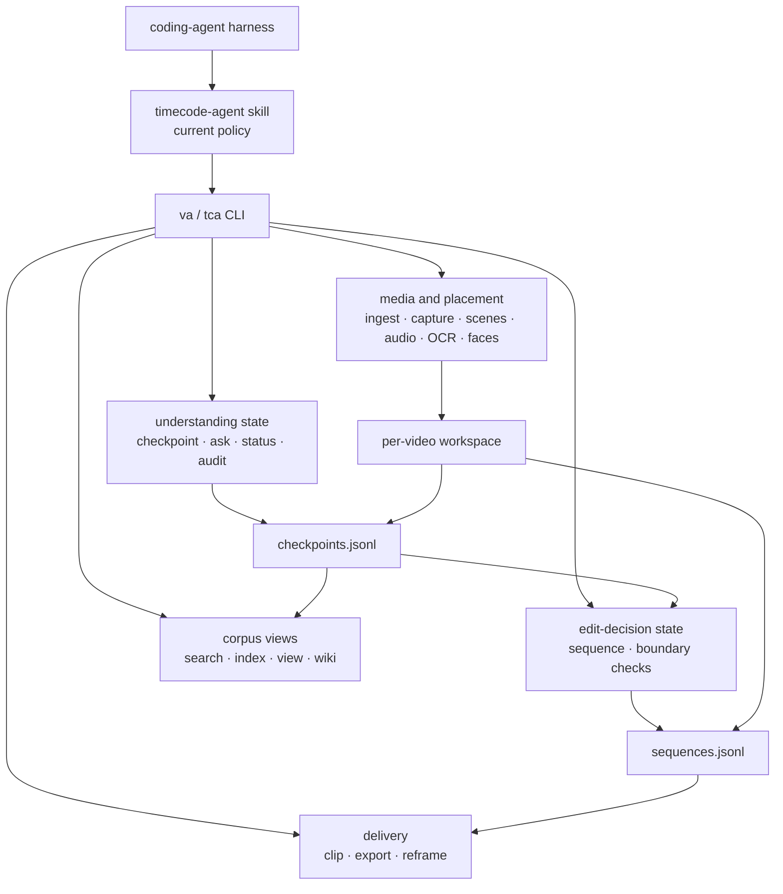

# Architecture

Last verified: 2026-08-06 against the current checkout.

TIMECODE-AGENT is one Python runtime with one current policy skill and two
physically separate append-only ledgers. The precise status is a
**shared-runtime dual-ledger foundation**:

- `checkpoints.jsonl` stores understanding claims and their revisions.
- `sequences.jsonl` stores edit decisions and their revisions.
- the current `timecode-agent` skill drives both loops through the same
  `va`/`tca` CLI.
- a separate `editcode-agent` policy and typed edit-to-understanding hand-back
  protocol are not implemented.

The package does not embed an LLM. A compatible coding-agent harness supplies
meaning-level judgment and invokes deterministic or learned local tools.

## Runtime map



## Measurement, perception and meaning

The placement/selection boundary is epistemic, not a claim that every
non-LLM tool is deterministic.

| Level | Examples | What it may establish |
|---|---|---|
| P0: physical or formal measurement | timestamps, frame differences, audio energy, sharpness | a measurable change or candidate location |
| P1: learned perception | ASR, OCR strings, faces, speaker turns, audio-event labels | a model-scored perceptual candidate |
| P2: semantic claim | identity, motive, event, causal relation | an agent-authored interpretation that needs evidence |
| P3: edit decision | ordered cuts, boundary state, handoff intent | a separately persisted decision grounded in P2 claims |

P0 and P1 propose where inspection may be useful. They do not independently
promote a hypothesis to semantic truth. P2 claims are recorded as
checkpoints, with support and status tracked separately. P3 uses a distinct
sequence ledger and never writes facts back into P2.

## Component boundaries

| Surface | Main implementation | Responsibility |
|---|---|---|
| Policy | `skill/SKILL.md` | transcript-first hypotheses, evidence selection, stopping and handoff rules |
| CLI | `src/video_agent/cli.py`, `cli_parser.py` | `va`/`tca` command contract and dispatch |
| Workspace commands | `cli_commands_workspace.py`, `cli_commands_global.py` | adapters between CLI requests and feature modules |
| Media and placement | `ingest.py`, `capture.py`, `keyframes.py`, `scenes.py`, `highlights.py`, `audio_events.py`, `ocr.py`, `faces.py`, `diarize.py` | media acquisition and P0/P1 candidates |
| Revision and temporal identity | `revision.py`, `revision_types.py`, `workspace_lifecycle.py`, `temporal.py` | pre-transcription source seal, content-derived source/transcript/timing revisions, safe same-source retry of explicit `building` ingests, fail-closed published-workspace reuse and half-open stream PTS dual-write |
| Transcript projection boundary | `transcript_segments.py` | keeps valid finite ordered segments from a top-level array while brief/search/index/wiki/view/keyframe/diarization/SRT surfaces skip malformed members |
| Workspace and ledger locking | `workspace_lock.py`, `workspace.py`, `cli.py` | shared operation leases except the exclusive diarization transcript-revision transition, one frozen leased corpus snapshot per command, inode-deduplicated aliases, stable sidecars and a read-only directory-inode fallback for legacy workspaces |
| Understanding ledger | `checkpoint_schema.py`, `checkpoint_store.py`, `checkpoints.py` | locked append-only claim history and latest-revision projection |
| Person-presence observation writer | `person_presence.py`, `cli_commands_workspace.py::cmd_checkpoint_observe` | binds one tracked, uncropped point frame to a typed observation; unresolved states stay hypothesized |
| Question read model | `ask.py`, `ask_types.py`, `ask_locale.py`, `ask_render.py`, `ask_serialization.py`, `cli_ask_parser.py`, `cli_commands_workspace.py::cmd_ask` | calculates one deterministic, read-only `AskEnvelope` from structured person-presence evidence, then projects Korean/English human text or compact English-coded agent JSON without recomputing evidence |
| Grounding and readiness | `verification.py`, `status.py`, `corpus_audit.py` | resolvable support checks, time overlap and advisory readiness |
| Image provenance | `image_model.py`, `image_store.py`, `image_catalog.py` | capture identity, cause and timestamp relations |
| Edit ledger | `sequence_schema.py`, `sequence_store.py`, `sequence_grounding.py` | ordered trims, forward-only states and checkpoint grounding |
| Delivery | `clip.py`, `export.py`, `reframe.py` | media extraction and EDL/FCPXML/OTIO/SRT/Markdown handoff |
| Corpus read model | `corpus_projection.py`, `search.py`, `index.py`, `scene_log.py`, `view.py`, `wiki.py` | cross-video search and derived human-readable views |

## Authority and persistence

| Artifact | Authority | Rule |
|---|---|---|
| manifest, transcript and signal JSON | base observations | ingest seals source bytes and full stat before ASR, requires both to remain unchanged through publication, and binds source bytes, canonical transcript JSON and timing metadata to revision IDs; diarization may advance the transcript revision only before dependent evidence exists; a published workspace is not overwritten by ingest |
| `image-provenance.jsonl` | capture causality | locked append-only, workspace-revision-bound events; not semantic entailment |
| `checkpoints.jsonl` | understanding claims | every new append is workspace-revision-bound and uses `hypothesized`, `verified` or `corrected` state; historical unbound workspaces are read-only |
| `sequences.jsonl` | edit decisions | append-only workspace-revision-bound records in forward-only edit states |
| index, HTML view and exports | derived surfaces | rebuildable from authoritative inputs |
| wiki `tca:notes` and scene-log narrative | authored exception | preserved from existing files; not yet replayed from a ledger |

`va checkpoint observe` binds one agent-selected, provenance-tracked, uncropped
point frame to a typed `person_presence` checkpoint. It derives the timestamp
and matching evidence path; `present` and `absent` are verified while
`uncertain` remains hypothesized.

`va ask` routes only the seated-man screen-departure count intent, including
natural Korean variants; ambiguous subjects, actions, or count requests are
rejected before evidence is read. It calculates one canonical `AskEnvelope`
from typed observations and full-resolution timestamped frames tracked to the
current workspace revision. Korean and English human renderers localize that
envelope. Compact `agent-json` instead carries English identifiers/reason codes
and a normalized `reply_locale`, so the host LLM can answer in another user
language without parsing human prose. The runtime does not invoke an LLM or a
translation service, and neither projection recalculates the evidence.

The command never appends or rewrites checkpoints or image provenance. Point
observations under half-open spans cannot prove continuous whole-video
coverage, so the envelope is `partial` or `unobserved`, never a fabricated
complete result. Uncertain intervals and equal-bin midpoint inspection
suggestions stay separate from the verified count; zero verified departures is
not proof that no departure occurred.

New workspaces create `.workspace.lock`, `.checkpoint.lock`,
`.image-provenance.lock`, and `.sequences.lock` before the manifest is
published. Each existing-workspace or corpus CLI command keeps a shared
operation lease for every canonical workspace it uses; diarization takes the
exclusive side while advancing the canonical transcript revision.
`Workspace.create()` and public revision publication take that exclusive lease
before the manifest lock, so direct draft recreation cannot cross a
diarization publication. Direct creation also rejects manifest-less durable
evidence before issuing a draft marker and applies the same-source,
no-authored-evidence guard to direct `building` retries. Ingest is also
exclusive before publishing or mutating a workspace and keeps it through CLI
manifest or signal-brief rendering. Corpus handlers use the exact leased
discovery snapshot, mutable aliases are replaced by their canonical targets,
and case or Unicode aliases are deduplicated by directory inode. Readers open stable
ledger targets read-only, so an atomic JSONL replacement cannot bypass a held
lock. Legacy workspaces without sidecars use the workspace directory inode and
empty reads remain non-mutating. Ingest fails before mutation when a ready or
legacy manifest already exists or when a manifest-less directory contains
durable evidence. An explicit `building` manifest can be retried only with the
same source and no append-only/authored evidence; its source-derived audio
cache is promoted only when the full source fingerprint remains unchanged
across extraction, and is accepted only when it matches the active source
content seal.
Successful publication marks it `ready`. Corpus read commands omit `building`
workspaces while GC continues to discover them for reporting or cleanup. A new
source or transcript generation requires a fresh output path. A failed
diarization revision publication restores the prior manifest, transcript and
diarization output before releasing its exclusive lease. Ingest and diarization
also compare the full source-stat snapshot across their operation window, so an
A→B→A restoration fails closed. Because the operation and ledger domains share
that directory inode, each published legacy-workspace
command takes it exclusively for the command lifetime rather than attempting a
self-conflicting shared-to-exclusive upgrade. Logical lock names are resolved
through filesystem aliases before re-entrancy checks, so aliases to the same
inode cannot bypass an active lock.

Historical unbound ledgers remain readable, but their workspaces reject new
checkpoint, image-provenance, and sequence writes. There is no migration
command; a fresh ingest into a new `-o` path is the only way to resume the
understanding loop on that source. `va audit` reports how many workspaces are
in this state, because a corpus can be frozen without any surface saying so. A current-version draft created directly through the Python
API binds its current source, transcript, and timing on its first evidence
write.

Destructive whole-workspace GC pins the planned directory identity and latest
activity timestamp, then takes the exclusive operation lease and every ledger
lock without waiting before it removes anything. It atomically renames the
verified directory to a private same-parent claim before recursive removal, so
a fresh workspace at the public pathname survives. Replaced, changed, or
active workspaces are skipped. A partial recursive-delete failure is restored
when safe, reported as partial, and accounts only for bytes actually removed.
If the public name has already been reused, the report exposes the remaining
private claim path instead of overwriting the fresh workspace.

The authored exception matters: deleting a wiki or scene log that contains
those blocks loses authored state. The safe rebuild rule today is:

```text
ledgers + manifest + preserved authored blocks -> derived views
```

Scene-log title migration preserves conflicts explicitly. An authored canonical
log keeps priority. If the canonical log is absent or still a generated
placeholder, the newest authored stale `type: tca-scene-log` projection wins
by modification time and filename. Every other authored candidate moves intact
to the workspace path `conflicts/scene-logs/` (with a numeric suffix on name
collision), which future builds leave untouched. Only stale generated
placeholders are deleted.

Wiki entity rebuilds accept only regular local entity directories and pages.
Symlinked active/quarantine directories or pages fail closed before notes are
read, compared, moved or removed, preventing an external authored file from
being consumed by projection cleanup.

## Understanding and editing boundary

The two names below describe procedures, not separate installed agents.

| | Understanding loop | Editing loop |
|---|---|---|
| Question | what is present, when, and with what support? | does this ordered trim satisfy the brief and grounding gates? |
| Writes | checkpoint ledger | sequence ledger |
| Reads | transcript, signals, frames, prior checkpoints | checkpoints, signals and candidate media |
| Hard machine gates | schema, resolvable support and time overlap | schema plus terminal checkpoint grounding and revision pins |
| Human/agent judgment | meaning, identity, causality and sufficiency | selection, rhythm, montage and aesthetic intent |

An edit decision never mutates the understanding ledger. If a cut depends on
a wrong claim, the checkpoint is corrected upstream and the edit is
re-derived. This is a logical write boundary; caller-specific capability
enforcement is not implemented yet.

Two deterministic gates extend this boundary: `va beat-eval` checks every
output-timeline join of a sequence against a `va beats` beat grid
(p90 offset <= 40 ms) without writing anything, and skill promotion from
recurring procedures requires tool-coherent sources — `va skillgen --route`
reports, per task, which gate still blocks promotion.

Self-reported model confidence is not a stopping proof. The policy stops only
when decision-critical claims have current support, relevant audit warnings
and contradictions are resolved or explicitly qualified, and another
inspection is unlikely to change the answer within the remaining budget.
`va status` readiness is advisory evidence for that decision.

## Implemented versus planned

| Implemented now | Not implemented |
|---|---|
| one product, repository, CLI, runtime and media cache | separate `editcode-agent` policy and thin orchestrator |
| separate checkpoint and sequence schemas, locks and files | caller-specific ledger write capabilities |
| terminal sequence grounding to supported, time-overlapping checkpoints | typed evidence request/resolution hand-back |
| terminal checkpoint revision/content-hash pins in edit handoff | edit-specific value-of-information policy |
| source/transcript/timing-bound checkpoint, image and sequence records | automatic legacy migration and revision diff |
| half-open stream PTS dual-write; full decoded-CFR cadence proof before revision-bound NLE handoff | persisted decoded-frame index/snapping and VFR NLE export |
| append-only image/capture provenance | W3C PROV serialization or C2PA signing |
| EDL, FCPXML, OTIO, SRT and Markdown delivery | universal NLE compatibility guarantee |
| incrementally synced FTS5 corpus search (word+trigram) and Markdown/HTML/wiki views | persistent vector database or mandatory query router |
| deterministic cut-boundary measurements and advisory flags | viewer attention, working-memory or surprise estimator |

## Operating boundaries

- The tested runtime boundary is Python 3.12 on macOS and Linux. Windows is
  experimentally supported: ledger locks fall back to `msvcrt.locking` (shared requests degrade to exclusive; the legacy no-sidecar fallback creates the sidecar). CI verifies install, the lock round-trip, and the CLI on Windows; ffmpeg-based end-to-end flows are not yet exercised there.
- Media processing and persistence are local by default.
- The default installer prepares ungated faster-whisper, Apple-Silicon MLX and
  sherpa assets. Pyannote code is installed but its Hugging Face model remains
  account-gated; sherpa is the immediately usable fallback.
- All features start enabled. Persistent `va runtime` policy separates feature
  availability from backend selection: `balanced` keeps measured stable
  faster-whisper/software paths, while `low-power` selects MLX and
  VideoToolbox/AudioToolbox on Apple Silicon with ASR quality fallback.
- URL ingest uses the network; direct package installs may download models on
  first use.
- `VIDEO_AGENT_CACHE_DIR` overrides the cache root; Linux also honors
  `XDG_CACHE_HOME`.
- The coding-agent harness is external to this package and may use a hosted
  model or incur its own cost.
- OpenTimelineIO export produces OTIO timeline data and metadata; target NLE
  adapter support must be verified separately.
- The provenance ledger is evidence-traceable application state. It is not
  cryptographically tamper-evident and is not C2PA-equivalent.
